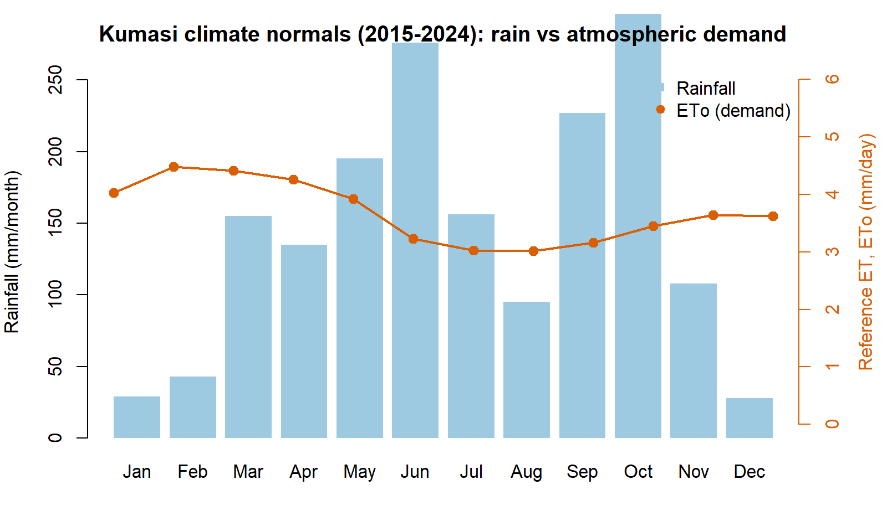
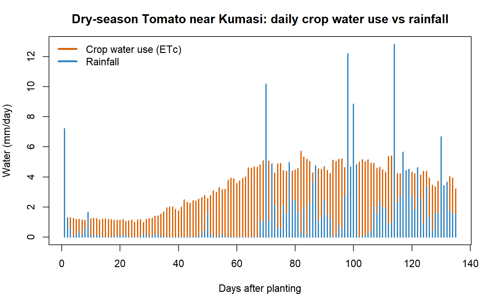
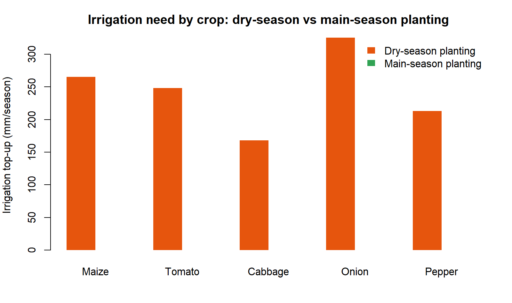
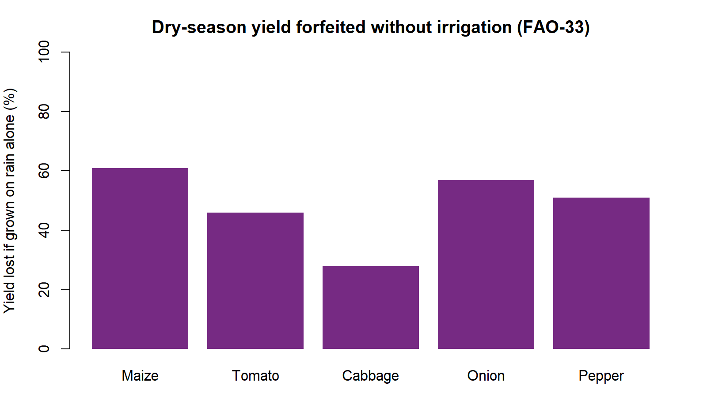

# How Much Water Does My Crop Need?

**A practical guide to crop water and irrigation requirements for farms near Kumasi — with the `sebkc` R package**

This is the *plain-language* companion to the technical `sebkc` manual. It has one goal:
to help you answer a real question a farmer, extension officer or student near Kumasi
actually asks —

> *"If I plant tomatoes (or maize, or onions) on this date, how much water will the
> crop need, how much will the rain give me, and how much must I add by irrigation?"*

You will get real numbers, for real crops, from real weather. You do **not** need to be a
hydrologist. Every equation is set apart in an **optional "the maths behind it" note** — the R
code does the mathematics for you, so you can read past them. If you can copy and run five lines
of R, you can do this.

Dr George Owusu
Department of Geography and Resource Development, University of Ghana

```
Companion to: "Evapotranspiration from Weather and Satellites: A Guide to sebkc"
Package: sebkc   (>= 1.0-8)
Audience: farmers, extension officers, irrigation planners, agriculture students
You need: basic R (how to run a script). No satellite data. No soil samples.
License: GPL-2
```

> **Every number and figure in this guide was produced by running the package.**
> The script that regenerates them, `reproduce_water_needs.R`, ships in this folder; its
> console log is `repro_water_needs_output.txt` and its figures are in `figures/`. The
> numbers were produced on R 4.6.0 with `sebkc`.

---

## Contents

1. [The problem, in one picture](#1-the-problem-in-one-picture)
2. [What you need (and what you already have)](#2-what-you-need-and-what-you-already-have)
3. [Step 1 — Get the weather (it is already up to date)](#3-step-1--get-the-weather-it-is-already-up-to-date)
4. [Step 2 — How thirsty is the air? (`ETo`)](#4-step-2--how-thirsty-is-the-air-eto)
5. [Step 3 — How much does *my* crop drink? (the crop coefficient)](#5-step-3--how-much-does-my-crop-drink-the-crop-coefficient)
6. [Step 4 — The crop's water need for the whole season](#6-step-4--the-crops-water-need-for-the-whole-season)
7. [Step 5 — How much must I irrigate? A worked tomato season](#7-step-5--how-much-must-i-irrigate-a-worked-tomato-season)
8. [Step 6 — Five crops, two planting seasons, one table](#8-step-6--five-crops-two-planting-seasons-one-table)
9. [Step 7 — From water to yield: what the shortage costs](#9-step-7--from-water-to-yield-what-the-shortage-costs)
10. [What the numbers tell a farmer near Kumasi](#10-what-the-numbers-tell-a-farmer-near-kumasi)
11. [Going further — day-by-day scheduling with `kc`](#11-going-further--day-by-day-scheduling-with-kc)
12. [Getting weather anywhere — `weather()` across Africa and beyond](#12-getting-weather-anywhere--weather-across-africa-and-beyond)
13. [Projects — try it yourself](#13-projects--try-it-yourself)
14. [Consideration notes on the numbers](#14-consideration-notes-on-the-numbers)
15. [The whole guide in one script](#15-the-whole-guide-in-one-script)
16. [Equation appendix (for the curious)](#16-equation-appendix-for-the-curious)
17. [References](#17-references)

---

## 1. The problem, in one picture

Kumasi sits in Ghana's forest zone. Its rain does not fall evenly: there is a long rainy
stretch from about **March to July**, a short break in August, a second peak around
**September–October**, and a genuinely dry **Harmattan** from **December to February** when
almost no rain falls at all. Meanwhile the *air* is thirstiest in exactly that dry window —
hot, bright days pull water out of leaves and soil fastest.

The city itself is built up, so the "farms near Kumasi" we care about are the market-garden
and food plots on its edges — Bomso, Ejisu, Kwadaso, the valleys along the rivers — growing
vegetables and maize for the city.

**Figure 1** shows the whole problem at a glance: the blue bars are the rain Kumasi can expect
in an average month; the orange line is how much water the atmosphere tries to evaporate each
day (the "demand"). Where the orange line is high and the blue bars are low — **December,
January, February** — a crop is thirsty and the sky will not help. That gap is what irrigation
has to fill.



*Figure 1. Kumasi monthly rainfall (blue bars) and reference evapotranspiration, the atmosphere's water demand (orange line), averaged over 2015–2024. The dry, thirsty Harmattan window — December to February — is where irrigation matters most.*

Here are those same normals as a table (mean of 2015–2024, produced by the package):

| Month | ETo (mm/day) | Rain (mm) | | Month | ETo (mm/day) | Rain (mm) |
|------|------|------|---|------|------|------|
| Jan | 4.03 | 29  | | Jul | 3.03 | 156 |
| Feb | 4.48 | 43  | | Aug | 3.02 | 95  |
| Mar | 4.41 | 155 | | Sep | 3.16 | 227 |
| Apr | 4.26 | 135 | | Oct | 3.45 | 296 |
| May | 3.92 | 195 | | Nov | 3.64 | 108 |
| Jun | 3.23 | 276 | | Dec | 3.62 | 28  |

Read it and you already understand the punchline of this whole guide: **plant in the main
rains and the sky waters your crop; plant in the dry season and you must.** The rest of the
guide just turns that intuition into numbers you can budget with.

---

## 2. What you need (and what you already have)

You need three things, and `sebkc` gives you all three:

1. **Weather for Kumasi** — bundled with the package, and already brought up to the present
   for you (Section 3). You do not download anything.
2. **A way to turn weather into "atmospheric demand"** — the `ETo()` function (Section 4).
3. **A way to turn demand into a specific crop's need and its irrigation gap** — the `kc()`
   function (Sections 5–7).

Install the package once:

```r
install.packages("sebkc")     # from CRAN
# or the latest version:
# remotes::install_github("gowusu/sebkc")
library(sebkc)
```

That is the whole toolbox. No satellite images, no field sensors.

---

## 3. Step 1 — Get the weather (it is already up to date)

The package ships a daily weather record for Kumasi. It used to stop in 2015; it has been
**extended to the present** using NASA's POWER service, so when you call it you get data right
up to a few days ago — no action needed on your part.

```r
kumasi <- readRDS(system.file("extdata", "kc", "kumasi1960_present.rds",
                              package = "sebkc"))
kumasi$Date <- as.Date(kumasi$DOY)
range(kumasi$Date)
#> [1] "1960-01-01" "2026-07-20"
nrow(kumasi)
#> [1] 24308
```

More than **24,000 days** of weather — over 66 years — with everything a water calculation
needs: maximum and minimum temperature, humidity, wind, sunshine and rainfall. Each row is one
day. That is all the input we will use.

> **Why this matters.** A crop-water calculation is only as current as its weather. Because the
> record now runs to the present, you can plan for *this* season, not a season from a decade
> ago. Section 11 explains how the same one-line `weather()` call keeps it current, and how to
> do it for a different town.

---

## 4. Step 2 — How thirsty is the air? (`ETo`)

Before we talk about any crop, we measure how hard the atmosphere is pulling water out of a
standard, well-watered grass field. That standard thirst is called **reference
evapotranspiration**, written **ETo**, in millimetres per day. A hot, dry, windy day might be
5 mm; a cool, cloudy, humid day 3 mm. It is the *same for every crop* — it is a property of the
weather, not the plant.

`ETo()` computes it from one day's weather:

```r
day <- kumasi[kumasi$Date == "2025-01-15", ]
ETo(Tmax = day$Tmax, Tmin = day$Tmin, RHmax = day$RHmax, RHmin = day$RHmin,
    n = day$n, uz = day$uz, DOY = "2025-01-15", latitude = 6.72, altitude = 222)$ETo
#> about 4–5 mm on a dry-season day
```

Do that for every day of a season and you have the atmosphere's demand, day by day. Over our
2015–2024 normals it averages about **4.0–4.5 mm/day in the dry months** and dips to about
**3.0 mm/day in the cloudy heart of the rains** (Table in Section 1) — the atmosphere is
*less* thirsty when it rains, which is a double blessing.

**The maths behind it (optional).** `ETo()` uses the FAO‑56 Penman–Monteith equation, the
world standard:

$$ ET_o = \frac{0.408 \Delta (R_n-G) + \gamma \frac{900}{T+273} u_2 (e_s-e_a)}{\Delta + \gamma (1 + 0.34 u_2)} $$

Here $R_n$ is net radiation, $u_2$ is wind speed, $(e_s-e_a)$ is how dry the air is, and
$\Delta$ and $\gamma$ are constants that depend on temperature. You never type it — the function
reads it off the day's weather (Allen *et al.* 1998).

---

## 5. Step 3 — How much does *my* crop drink? (the crop coefficient)

A crop does not use the full atmospheric demand at every stage of its life. A tomato seedling
with two leaves shades almost no ground and uses little water; a tomato bush in full flower
covers the soil and drinks nearly as much as the atmosphere demands; a ripening plant closes
down again.

We capture that with one dimensionless number, the **crop coefficient `Kc`**. Multiply the
atmosphere's demand by `Kc` and you get *this crop's* water use:

> **the crop's water use = Kc × ETo**

`Kc` is small early, rises to a peak in mid-season, and falls near harvest. FAO‑56 gives three
anchor values for every crop — initial, mid-season and end — and the lengths of the four growth
stages. Here are the five crops we will use, straight from FAO‑56 Tables 11 and 12:

| Crop | Kc (start / peak / end) | Stage lengths (days) | Total | Root depth (m) |
|------|:----:|:----:|:----:|:----:|
| Maize (grain) | 0.30 / 1.20 / 0.35 | 20 · 35 · 40 · 30 | 125 | 1.0 |
| Tomato        | 0.60 / 1.15 / 0.80 | 30 · 40 · 40 · 25 | 135 | 0.9 |
| Cabbage       | 0.70 / 1.05 / 0.95 | 40 · 60 · 50 · 15 | 165 | 0.6 |
| Onion (dry)   | 0.70 / 1.05 / 0.75 | 15 · 25 · 70 · 40 | 150 | 0.45 |
| Pepper (bell) | 0.60 / 1.05 / 0.90 | 30 · 35 · 40 · 20 | 125 | 0.7 |

You give those numbers to `kc()` and it builds the day-by-day `Kc` curve for you. We pass them
in by hand rather than by crop name so that **you can see exactly what assumptions the answer
rests on** — and so you can change them for your own variety.

**The maths behind it (optional).** Between the mid-season plateau and harvest, `Kc` slides in a
straight line from its mid value to its end value:

$$ K_c = K_{c,mid} + \frac{\text{days into late stage}}{\text{length of late stage}} \times (K_{c,end} - K_{c,mid}) $$

The package also nudges the peak up or down for local wind and humidity. Again — you never type it.

---

## 6. Step 4 — The crop's water need for the whole season

Now put Steps 2 and 3 together. For a chosen crop and planting date, `kc()` walks through the
season one day at a time: it takes that day's `ETo`, multiplies by that day's `Kc`, and adds it
up. The seasonal total is the **crop water requirement, `ETc`** — the amount of water, in
millimetres, the crop will transpire and evaporate from planting to harvest.

```r
# daily ETo for the season (a helper; see the reproduce script)
season <- season_eto(start = "2024-11-15", ndays = 135)   # dry-season tomato

tomato <- kc(ETo = season$ETo, P = season$P, RHmin = 63.5, soil = "sandy loam",
             crop = "Tomato", I = 0, kctype = "single",
             kc = c(0.60, 1.15, 0.80), lengths = c(30, 40, 40, 25),
             Zr = 0.9, p = 0.40, h = 0.6)

sum(tomato$output$ETc)      # crop water requirement for the season, mm
#> 443
```

So a dry-season tomato crop near Kumasi needs about **443 mm** of water over its 135‑day life —
a little over **3.3 mm every day on average**, peaking near **5.7 mm/day** in mid-season. That
peak is the number an irrigation engineer cares about most: **your pump, drip line or watering
schedule has to be able to deliver ~6 mm/day at the busiest time**, even if the average is
lower.

---

## 7. Step 5 — How much must I irrigate? A worked tomato season

The crop needs 443 mm. The sky provides some of it. **Irrigation is the gap.**

Over that same November-to-March tomato season the rain gauge collects only about **194 mm** —
this is a dry-season planting, so most of the water has to come from you:

> **irrigation top-up ≈ crop need − rainfall = 443 − 194 ≈ 250 mm**

**Figure 2** shows why the gap opens up. The orange bars are the crop's daily water use climbing
as the plants grow; the blue bars are rainfall — frequent early, then drying up. After the first
few weeks the crop is drinking steadily while the sky has gone quiet.



*Figure 2. Daily crop water use (ETc, orange) and rainfall (blue) for a tomato crop planted
15 November near Kumasi. The crop's thirst rises through the season while dry-season rainfall
fades — the space between them is what irrigation must supply.*

Breaking the season into its four growth stages shows *when* the water is needed, which is how
you plan a watering calendar:

| Stage | Days | Crop need (mm) | Rain (mm) | Irrigation (mm) |
|------|:---:|:---:|:---:|:---:|
| Initial (seedlings)   | 30 | 35  | 13 | 22  |
| Development (growing) | 40 | 119 | 16 | 103 |
| Mid-season (flower/fruit) | 40 | 189 | 89 | 100 |
| Late (ripening)       | 25 | 99  | 76 | 23  |
| **Season**            | **135** | **443** | **194** | **≈248** |

The message is clear: the **development and mid-season stages carry almost all the irrigation
load** (about 200 of the 250 mm). Skimp on water then — when the plant is building its frame and
setting fruit — and yield falls hardest. The seedling and ripening stages are cheap.

---

## 8. Step 6 — Five crops, two planting seasons, one table

Do exactly the same for five common near-Kumasi crops, once planted in the **dry season**
(15 November 2024) and once in the **main rains** (15 March 2025). This single table is the
heart of the guide:

| Crop | Season | Days | ETo (mm) | Crop need ETc (mm) | Avg (mm/day) | Peak (mm/day) | Rain (mm) | **Irrigation (mm)** |
|------|------|:--:|:--:|:--:|:--:|:--:|:--:|:--:|
| Maize   | dry  | 125 | 512 | 435 | 3.5 | 5.9 | 171 | **265** |
| Tomato  | dry  | 135 | 554 | 443 | 3.3 | 5.7 | 194 | **248** |
| Cabbage | dry  | 165 | 680 | 471 | 2.9 | 5.2 | 302 | **168** |
| Onion   | dry  | 150 | 617 | 557 | 3.7 | 5.3 | 232 | **325** |
| Pepper  | dry  | 125 | 512 | 383 | 3.1 | 5.2 | 171 | **213** |
| Maize   | main | 125 | 466 | 488 | 3.9 | 6.1 | 742 | **0** |
| Tomato  | main | 135 | 494 | 525 | 3.9 | 5.8 | 759 | **0** |
| Cabbage | main | 165 | 578 | 601 | 3.6 | 5.7 | 824 | **0** |
| Onion   | main | 150 | 535 | 535 | 3.6 | 5.6 | 805 | **0** |
| Pepper  | main | 125 | 466 | 476 | 3.8 | 5.7 | 742 | **0** |

**Figure 3** draws the last column: irrigation need, dry-season planting versus main-season
planting.



*Figure 3. Seasonal irrigation top-up for each crop when planted in the dry season (orange) versus
the main rains (green). In the main season, seasonal rainfall meets or exceeds the crop's need,
so the top-up is essentially zero.*

---

## 9. Step 7 — From water to yield: what the shortage costs

Water is not the goal; **harvest** is. Two short calculations turn the water numbers into
yield numbers — the language a farmer actually budgets in.

**(a) What could the crop yield at best?** The `biomass()` function estimates a crop's potential
yield from the sunlight and temperature of the growing season — the ceiling a well-watered,
well-managed crop can reach. For maize near Kumasi:

```r
# season-average daytime temp, 24-h temp and solar radiation feed biomass()
biomass(Tday = 28.6, T24 = 26.6, Rs = 17.3, latitude = 6.72, HI = 0.40,
        plantdate = "2025-03-15", harvestdate = "2025-07-18", crop = "maize")$yield
#> about 3.2 t/ha of grain
```

The potential comes out near **3.1–3.2 t/ha of grain in either season** — the dry season is a
little sunnier (Rs 18.5 vs 17.3 MJ/m²/day) but a little hotter, so the ceiling is about the
same. The *difference between the seasons is not the ceiling — it is whether you reach it.*

**(b) How much of that harvest does a water shortage cost?** FAO's water–yield rule says the
share of yield you lose is proportional to the share of water the crop misses, scaled by a crop
sensitivity factor **Ky**:

> **yield lost (%) ≈ Ky × water shortage (%)**

Run each dry-season crop on **rain alone** (no irrigation) and read off how much water it misses,
then how much yield that costs:

| Crop | Ky | Water it misses on rain alone | **Yield lost if not irrigated** |
|------|:--:|:--:|:--:|
| Maize   | 1.25 | 49% | **61%** |
| Onion   | 1.10 | 51% | **57%** |
| Pepper  | 1.10 | 47% | **51%** |
| Tomato  | 1.05 | 44% | **46%** |
| Cabbage | 0.95 | 30% | **28%** |



*Figure 4. The share of potential yield lost when a dry-season crop near Kumasi is grown on
rainfall alone, with no irrigation (FAO-33 water–yield relation). Every crop loses at least a
quarter of its harvest; maize and onion lose well over half.*

This is the real argument for the irrigation numbers in Section 8. Dry-season maize left to the
rain does not just "look thirsty" — it **throws away about 61% of its grain**. The ~265 mm of
irrigation it needs is what buys that harvest back. Sensitive crops (high Ky — maize, onion) punish
under-watering hardest; hardy ones (cabbage) forgive it.

**The maths behind it (optional).** Potential biomass $B$ follows the FAO Agro-Ecological Zone
light-use model, and yield is $Y = HI \times B$, where $HI$ is the harvest index. The
water–yield loss is the FAO-33 relation:

$$ 1 - \frac{Y_a}{Y_m} = K_y \left(1 - \frac{ET_a}{ET_c}\right) $$

Here $Y_a/Y_m$ is actual over maximum yield and $ET_a/ET_c$ is actual over full crop water use.

---

## 10. What the numbers tell a farmer near Kumasi

You can now give straight answers to real decisions:

- **The dry season is an irrigation season, full stop.** Any of these crops planted in November
  needs roughly **170–325 mm** of applied water — that is 1.7 to 3.25 million litres per hectare
  across the season (1 mm = 10 m³ = 10,000 L per hectare). If you cannot supply that, do not
  plant that crop then.
- **The main season is (almost) free water.** Planted in March, every one of these crops is met
  by the rains — the irrigation column is **zero**. Main-season cropping needs *drainage*
  thinking, not irrigation thinking. (Watch short dry spells, but the seasonal budget is safe.)
- **Onions are the thirstiest to irrigate; cabbage the kindest.** Dry-season onions need the most
  top-up (**~325 mm**) — a long season and shallow roots. Cabbage needs the least (**~168 mm**)
  because its longest, thirstiest weeks catch the returning rains.
- **Size your system to ~6 mm/day.** Across every crop the *peak* daily need lands near
  **5–6 mm/day**. A drip or sprinkler system (and your labour) must be able to deliver about
  **6 mm/day per hectare = 60 m³/day** at mid-season, even though the average is lower.
- **Spend your water in the middle.** As the tomato stage table showed, the development and
  mid-season stages carry most of the irrigation and reward it with yield. Protect those weeks.

---

## 11. Going further — day-by-day scheduling with `kc`

The seasonal totals above answer *"how much water?"*. To answer *"which day do I water, and how
much?"* let `kc()` run its full **daily soil-water balance**. It tracks how much water the root
zone holds, how rain refills it, how the crop draws it down, and flags the day the soil dries to
the point the crop starts to feel stress:

```r
tomato$output[ , c("Day", "ETc", "P", "Drend", "Ks")]   # daily balance
```

- `ETc` — the crop's water use that day.
- `P` — rain that day.
- `Drend` — how empty the root zone is by day's end (mm of "room" to refill).
- `Ks` — a stress flag: `1.0` means comfortable, below `1.0` means the crop is running short.
  **Irrigate before `Ks` drops below 1.**

One practical warning this daily view reveals: **shallow-rooted crops need frequent watering
even in the rainy season.** A deep-rooted maize plant banks a big rain for a week; a shallow
onion cannot, so it can go short a few dry days after a downpour. If you grow onions or lettuce
in the minor rains, plan to water little and often rather than trusting the seasonal surplus.

The full mechanics of this balance — readily available water, stress coefficient, deep
percolation, the dual crop coefficient that splits soil evaporation from transpiration — are in
the technical manual, *"Evapotranspiration from Weather and Satellites: A Guide to sebkc."*

---

## 12. Getting weather anywhere — `weather()` across Africa and beyond

Nothing in this guide is special to Kumasi *except the coordinates*. The bundled Kumasi record
from 1960–2015 is the historical station series; from 2016 it is extended with **NASA POWER**
daily data — a free, global, satellite-and-model weather service — fetched through the package's
own `weather()` function. That is why "calling Kumasi data" already gives you an up-to-date
record. The *same one function* builds the identical record for any place on Earth.

### The one call you need

`weather()` needs only a longitude and a latitude (west and south are negative) and a date range:

```r
# Tamale, northern Ghana (lat 9.40, lon -0.84)
tamale <- weather(longitude = -0.84, latitude = 9.40,
                  NASA.SSE = list(from = "2016-01-01", to = "2026-07-20"))
wx <- tamale$NASA.SEE$data     # a data frame: Tmax Tmin RH uz Rs P date ...
head(wx)
```

That `wx` data frame drops straight into the **same `ETo()` → `kc()` → `biomass()`** steps you
have just followed. Change two numbers, get a full crop-water-needs assessment for a new place.

### A starter set of locations

Here are working coordinates across Africa and beyond — copy a row and go. (South of the equator
the latitude is negative; west of Greenwich the longitude is negative.)

| Place | Country / region | Latitude | Longitude |
|------|------|:--:|:--:|
| Kumasi | Ghana (forest) | 6.72 | −1.60 |
| Tamale | Ghana (savanna) | 9.40 | −0.84 |
| Accra | Ghana (coast) | 5.60 | −0.19 |
| Ouagadougou | Burkina Faso (Sahel) | 12.37 | −1.53 |
| Kano | Nigeria (Sahel) | 12.00 | 8.52 |
| Bamako | Mali | 12.64 | −8.00 |
| Nairobi | Kenya (highland) | −1.29 | 36.82 |
| Addis Ababa | Ethiopia (highland) | 9.03 | 38.74 |
| Lusaka | Zambia | −15.42 | 28.28 |
| Cairo | Egypt (arid) | 30.04 | 31.24 |
| Fresno | California, USA | 36.74 | −119.77 |
| New Delhi | India | 28.61 | 77.21 |

```r
# loop the whole starter set and pull each place's weather in one go
sites <- data.frame(
  place = c("Tamale","Ouagadougou","Nairobi","Cairo","Fresno"),
  lat   = c( 9.40,   12.37,       -1.29,    30.04,  36.74),
  lon   = c(-0.84,   -1.53,        36.82,   31.24, -119.77))

wx_all <- lapply(seq_len(nrow(sites)), function(i)
  weather(longitude = sites$lon[i], latitude = sites$lat[i],
          NASA.SSE = list(from = "2024-01-01", to = "2024-12-31"))$NASA.SEE$data)
names(wx_all) <- sites$place
```

Each place's climate is different — Cairo is bone dry and thirsty, Nairobi mild, Fresno a
Mediterranean irrigation belt — so each will give its own crop-water and irrigation answer from
the very same code. The method is genuinely global.

### Prefer a spreadsheet? Get the same data by hand

If you would rather not code the download, NASA POWER offers the identical data through a
point-and-click map:

- **POWER Data Access Viewer** — <https://power.larc.nasa.gov/data-access-viewer/>
  (pick a point, choose *Daily*, tick temperature, humidity, wind, radiation and precipitation,
  download CSV).
- **POWER homepage and API docs** — <https://power.larc.nasa.gov>.
- Other free daily sources you can feed in the same way: **Open-Meteo**
  (<https://open-meteo.com>), **ERA5 via Copernicus CDS** (<https://cds.climate.copernicus.eu>),
  and **NOAA Climate Data Online** (<https://www.ncei.noaa.gov/cdo-web/>).

Whichever route you take, line the columns up as `Tmax, Tmin, RHmax, RHmin, n` (or `Rs`)`, uz, P`
and the rest of this guide runs unchanged.

---

## 13. Projects — try it yourself

Short projects to turn this guide into skill. Each one is a small change to the code you already
have; none needs new tools. They make good class exercises or a first real piece of analysis.

1. **Your own town.** Pick a place from the Section 12 table (or your village's coordinates) and
   redo the five-crop, two-season table for it. How does its irrigation bill compare with Kumasi's?

2. **Best planting date.** For one crop, slide the planting date across the year in two-week steps
   and plot the seasonal irrigation need against planting date. When is the cheapest month to plant?

3. **A wet year vs a dry year.** The Kumasi record runs from 1960. Pick a known wet year and a known
   dry year, run the same dry-season tomato in each, and compare the irrigation and the yield loss.

4. **Size a reservoir.** Convert one crop's seasonal irrigation (mm) into cubic metres for a
   2-hectare farm (1 mm = 10 m³/ha) and add a 25% allowance for losses. How big a tank or dugout
   do you need to carry the dry season?

5. **The yield-loss curve.** For maize, run it at 0%, 25%, 50%, 75% and 100% of full irrigation and
   plot yield loss (FAO-33) against water applied. Where is the "most crop per drop" sweet spot?

6. **Deep vs shallow roots.** Run onion (shallow) and maize (deep) in the *main* season and use the
   daily `kc()` balance (Section 11) to count how many days each falls under stress despite the rain.

7. **Climate creep.** Compare average `ETo` for 1971–1980 against 2011–2020 from the bundled record.
   Has the atmosphere's demand near Kumasi shifted, and what would that add to irrigation?

8. **Two crops, one season.** Budget the water for an intercrop or a relay (e.g. maize followed by
   cabbage) and report the combined irrigation and the peak daily demand your system must meet.

---

## 14. Consideration notes on the numbers

So you can trust — and defend — these figures:

- **They are point estimates for one location and two specific planting dates** (Nov 2024,
  Mar 2025). A different year's rain will move the irrigation column; the dry-season *pattern*
  (irrigation essential) and the main-season pattern (rain-fed) are robust, the exact
  millimetres are not a guarantee.
- **The simple irrigation figure is "crop need − rainfall."** It treats the seasonal rain total
  as usable. In reality some rain runs off or drains below the roots, so real irrigation is a
  little *higher* than the simple number — the daily balance in Section 11 refines it.
- **Kc values are FAO‑56 tabulated defaults.** Your variety, spacing and management can shift
  them. They are excellent planning values, not field measurements — swap in your own if you
  have them.
- **`ETo` is only as good as the weather.** POWER is a gridded product (~50 km); it is superb for
  planning and trend, but a nearby station reading, if you have one, is closer to your field.

None of this changes the headline a farmer needs: **dry-season vegetables near Kumasi need
roughly 170–325 mm of irrigation; the same crops in the main rains need next to none.**

---

## 15. The whole guide in one script

Everything above — every number, table and figure — is produced by a single script that ships
in this folder, `reproduce_water_needs.R`. Run it and you reproduce this guide exactly:

```r
# from the manual/ folder
source("reproduce_water_needs.R")
```

It (1) loads the up-to-date Kumasi record, (2) computes daily `ETo`, (3) runs `kc()` for the
five crops in two seasons, (4) estimates yield with `biomass()` and the FAO-33 water–yield rule,
(5) prints the tables you have seen, and (6) writes the four figures into `figures/`. Its console
log is saved as `repro_water_needs_output.txt`.

---

## 16. Equation appendix (for the curious)

Collected here so the body stays readable. You never type any of these — `sebkc` does.

**Reference evapotranspiration (FAO‑56 Penman–Monteith):**

$$ ET_o = \frac{0.408 \Delta (R_n-G) + \gamma \frac{900}{T+273} u_2 (e_s-e_a)}{\Delta + \gamma (1 + 0.34 u_2)} $$

**Crop water use:**

$$ ET_c = K_c \times ET_o $$

**Seasonal crop water requirement:**

$$ ET_{c,season} = \sum_{day=1}^{N} K_c \times ET_o $$

**Simple net irrigation requirement:**

$$ \text{Irrigation} = \max(0,\ ET_{c,season} - P_{effective}) $$

**Volume conversion (per hectare):**

$$ 1\ \text{mm} = 10\ \text{m}^3/\text{ha} = 10000\ \text{L/ha} $$

**Sunshine hours from solar radiation** (used to keep the modern weather homogeneous with the
historical record; Ångström–Prescott, inverted):

$$ n = \frac{N}{b_s}\left(\frac{R_s}{R_a} - a_s\right), \quad a_s = 0.25,\ b_s = 0.50 $$

**Yield lost to water shortage (FAO-33):**

$$ 1 - \frac{Y_a}{Y_m} = K_y \left(1 - \frac{ET_a}{ET_c}\right) $$

---

## 17. References

- Allen, R. G., Pereira, L. S., Raes, D., & Smith, M. (1998). *Crop Evapotranspiration:
  Guidelines for Computing Crop Water Requirements.* FAO Irrigation and Drainage Paper 56. Rome: FAO.
- Doorenbos, J., & Kassam, A. H. (1979). *Yield Response to Water.* FAO Irrigation and Drainage
  Paper 33. Rome: FAO. (The water–yield factor Ky used in Section 9.)
- Owusu, G. *sebkc: Surface Energy Balance and Crop Coefficient ET* [R package]. CRAN /
  <https://github.com/gowusu/sebkc>.
- NASA POWER Project. *Prediction of Worldwide Energy Resources — Daily data.*
  <https://power.larc.nasa.gov>.
- Companion volume: Owusu, G. *Evapotranspiration from Weather and Satellites: A Guide to the
  sebkc R Package* (the technical `sebkc` manual, `manual/sebkc_manual.md`).

---

### How to cite this guide

> Owusu, G. (2026). *How Much Water Does My Crop Need? A Practical Guide to Crop Water and
> Irrigation Requirements for Farms near Kumasi with the sebkc R Package.* Department of Geography
> and Resource Development, University of Ghana.
